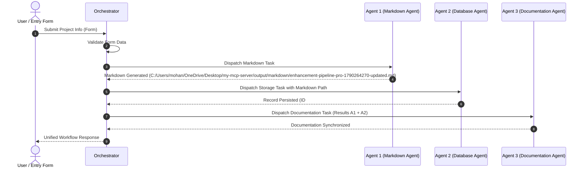

# Comprehensive Project Documentation: Enhancement Pipeline Pro 1790264270 (Updated)

> **Workflow Run ID:** `wf_upd_20260924_210750_6e6b3a`  
> **Generated Timestamp:** `2026-09-24T15:37:50.323573+00:00`  
> **Synchronization Status:** Synchronized & Active

---

## 1. Project Overview
This document provides complete technical, operational, and architectural documentation for **Enhancement Pipeline Pro 1790264270 (Updated)**.
It is automatically compiled and maintained by **Agent 3 (Documentation Agent)** to remain synchronized with implementation artifacts.

- **Project Identifier / Slug:** `enhancement-pipeline-pro-1790264270-updated`
- **Operational Status:** Active
- **Version:** v3
- **Description:**  
  > Completely refreshed architecture description with TLS 1.3 encryption and zero trust.

---

## 2. Requirements & Specifications
The functional and technical requirements specified for this project:

```text
Zero Trust mTLS
Automated canary deployments
99.999% availability SLA
```

**Additional Notes & Constraints:**
```text
Updated compliance target: SOC2 Type II.
```

---

## 3. Agent Architecture
The system employs a 3-agent autonomous architecture coordinated by a central orchestrator:

| Agent | Responsibility | Implementation File | Key Mechanism |
| :--- | :--- | :--- | :--- |
| **Agent 1: Markdown Agent** | Generates & updates clean Markdown files | `agents/agent1_markdown/agent.py` | Frontmatter parsing, checklist formatting, version incrementing, deduplication |
| **Agent 2: Database Agent** | Validates and stores data in SQLite | `agents/agent2_database/agent.py` | Schema assurance, parameterized SQL, duplicate prevention, audit logs |
| **Agent 3: Documentation Agent** | Maintains synchronized system docs | `agents/agent3_documentation/agent.py` | Cross-agent artifact collation, project catalog synchronization |

---

## 4. Multi-Agent Workflow
Execution trace detailing sequential execution:



---

## 5. Database Schema & Persistence
Data is persisted in SQLite with Write-Ahead Logging (WAL) enabled:

- **Target Table:** `projects`
- **Record Primary Key:** `#8`
- **Revision Counter:** `v3`
- **Operation Performed:** `updated`

### Schema Structure:
```sql
CREATE TABLE IF NOT EXISTS projects (
    id INTEGER PRIMARY KEY AUTOINCREMENT,
    project_name TEXT NOT NULL UNIQUE COLLATE NOCASE,
    slug TEXT NOT NULL UNIQUE,
    description TEXT NOT NULL,
    requirements TEXT NOT NULL,
    additional_info TEXT,
    markdown_path TEXT,
    version INTEGER DEFAULT 1,
    status TEXT DEFAULT 'active',
    created_at TIMESTAMP DEFAULT CURRENT_TIMESTAMP,
    updated_at TIMESTAMP DEFAULT CURRENT_TIMESTAMP
);
```

---

## 6. Markdown Generation & Artifacts
Agent 1 creates clean, structured Markdown specifications:

- **Artifact Path:** [`C:/Users/mohan/OneDrive/Desktop/my-mcp-server/output/markdown/enhancement-pipeline-pro-1790264270-updated.md`](C:/Users/mohan/OneDrive/Desktop/my-mcp-server/output/markdown/enhancement-pipeline-pro-1790264270-updated.md)
- **Document Version:** `v1`
- **Generation Status:** `created`
- **Format:** YAML frontmatter, executive overview, checklist items, and Mermaid diagrams.

---

## 7. APIs & Integration Reference

### REST Endpoints
```http
POST /api/submit
Content-Type: application/json

{
  "project_name": "Enhancement Pipeline Pro 1790264270 (Updated)",
  "description": "Completely refreshed architecture description with TLS 1.3 encryption and zero trust.",
  "requirements": "...",
  "additional_info": "Updated compliance target: SOC2 Type II."
}
```

```http
GET /api/projects?status=active|archived|all
GET /api/projects/{id}
PUT /api/projects/{id}
DELETE /api/projects/{id}?permanent=false|true
GET /api/preview?path=output/markdown/...
```

### Model Context Protocol (MCP) Tools
- `orchestrate_workflow(project_name, description, requirements, additional_info)`: Full 3-agent pipeline
- `update_existing_project(project_id, project_name, description, requirements, additional_info)`: Full update pipeline
- `archive_or_delete_project(project_id, permanent)`: Soft archive or permanent delete
- `create_or_update_markdown(...)`: Independent Agent 1 execution
- `store_project_in_database(...)`: Independent Agent 2 execution
- `generate_project_documentation(...)`: Independent Agent 3 execution
- `list_projects(status)`: Query SQLite project catalog

---

## 8. Input Validation & Data Integrity Rules
- **Strict Typing:** Rejects boolean, number, array, and object types without silent coercion.
- **Content Hygiene:** Leading and trailing whitespace is automatically stripped; empty or whitespace-only strings are rejected.
- **Length Boundaries:**
  - `project_name`: 2 to 120 characters
  - `description`: 5 to 5000 characters
  - `requirements`: 5 to 5000 characters
  - `additional_info`: Maximum 3000 characters
- **SQL Injection Prevention:** Fully parameterized SQLite queries across all operations.
- **Revision Control:** Version increments monotonically with each update, logging audit events in `workflow_runs`.

---

## 9. Inputs and Outputs Specification

### Agent 1 (Markdown Agent)
- **Input:** `MarkdownInput(project_name, description, requirements, additional_info)`
- **Output:** `{ "status": "success/failure", "file_path": "...", "summary": "..." }`

### Agent 2 (Database Agent)
- **Input:** `DatabaseInput(project_name, description, requirements, additional_info, markdown_path)`
- **Output:** `{ "status": "success/failure", "record_id": "...", "message": "..." }`

### Agent 3 (Documentation Agent)
- **Input:** `DocumentationInput(project_name, description, requirements, markdown_result, database_result)`
- **Output:** `{ "status": "success/failure", "documentation_path": "...", "summary": "..." }`

---

## 9. Configuration & Environment Variables
Configuration is loaded dynamically from `.env`:

| Key | Default | Purpose |
| :--- | :--- | :--- |
| `DATABASE_PATH` | `database/projects.db` | Path to SQLite file |
| `MARKDOWN_OUTPUT_DIR` | `output/markdown` | Target directory for Markdown files |
| `DOCS_DIR` | `docs` | Target directory for documentation |
| `HOST` / `PORT` | `127.0.0.1` / `8000` | Web server listening address |
| `MCP_ENABLED` | `True` | FastMCP protocol activation |

---

## 10. Installation & Setup Guide
1. Clone / open repository.
2. Initialize virtual environment and install dependencies:
   ```powershell
   uv sync
   # Or using standard python:
   python -m venv .venv
   .\.venv\Scripts\pip install -e .
   ```
3. Run Web Server & Entry Form:
   ```powershell
   .\.venv\Scripts\python.exe server.py
   ```

---

## 11. Testing & Verification Runbook
Execute tests independently or collectively:
```powershell
# Run Master Test Suite
.\.venv\Scripts\python.exe tests/run_all_tests.py

# Run Individual Agent Tests
.\.venv\Scripts\python.exe tests/test_agent1_markdown.py
.\.venv\Scripts\python.exe tests/test_agent2_database.py
.\.venv\Scripts\python.exe tests/test_agent3_documentation.py
.\.venv\Scripts\python.exe tests/test_orchestrator.py
```
