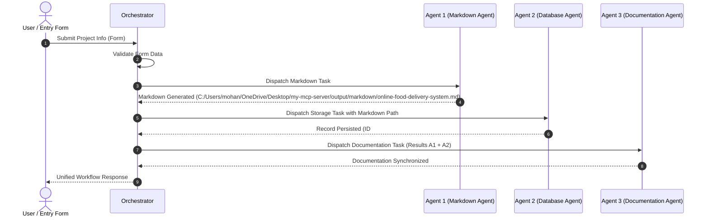

# Comprehensive Project Documentation: Online Food Delivery System

> **Workflow Run ID:** `wf_20260924_202247_bd4842`  
> **Generated Timestamp:** `2026-09-24T14:52:47.914615+00:00`  
> **Synchronization Status:** Synchronized & Active

---

## 1. Project Overview
This document provides complete technical, operational, and architectural documentation for **Online Food Delivery System**.
It is automatically compiled and maintained by **Agent 3 (Documentation Agent)** to remain synchronized with implementation artifacts.

- **Project Identifier / Slug:** `online-food-delivery-system`
- **Operational Status:** Active
- **Version:** v1
- **Description:**  
  > A web application for ordering the food and tracking it

---

## 2. Requirements & Specifications
The functional and technical requirements specified for this project:

```text
-user login
-restaurant listing
-food ordering
-online payment
-order tracking
```

**Additional Notes & Constraints:**
```text
The system should be secure ,responsive and easy to use
```

---

## 3. Agent Architecture
The system employs a 3-agent autonomous architecture coordinated by a central orchestrator:

| Agent | Responsibility | Implementation File | Key Mechanism |
| :--- | :--- | :--- | :--- |
| **Agent 1: Markdown Agent** | Generates & updates clean Markdown files | `agents/agent1_markdown/agent.py` | Frontmatter parsing, checklist formatting, version incrementing, deduplication |
| **Agent 2: Database Agent** | Validates and stores data in SQLite | `agents/agent2_database/agent.py` | Schema assurance, parameterized SQL, duplicate prevention, audit logs |
| **Agent 3: Documentation Agent** | Maintains synchronized system docs | `agents/agent3_documentation/agent.py` | Cross-agent artifact collation, project catalog synchronization |

---

## 4. Multi-Agent Workflow
Execution trace detailing sequential execution:



---

## 5. Database Schema & Persistence
Data is persisted in SQLite with Write-Ahead Logging (WAL) enabled:

- **Target Table:** `projects`
- **Record Primary Key:** `#2`
- **Revision Counter:** `v1`
- **Operation Performed:** `inserted`

### Schema Structure:
```sql
CREATE TABLE IF NOT EXISTS projects (
    id INTEGER PRIMARY KEY AUTOINCREMENT,
    project_name TEXT NOT NULL UNIQUE COLLATE NOCASE,
    slug TEXT NOT NULL UNIQUE,
    description TEXT NOT NULL,
    requirements TEXT NOT NULL,
    additional_info TEXT,
    markdown_path TEXT,
    version INTEGER DEFAULT 1,
    status TEXT DEFAULT 'active',
    created_at TIMESTAMP DEFAULT CURRENT_TIMESTAMP,
    updated_at TIMESTAMP DEFAULT CURRENT_TIMESTAMP
);
```

---

## 6. Markdown Generation & Artifacts
Agent 1 creates clean, structured Markdown specifications:

- **Artifact Path:** [`C:/Users/mohan/OneDrive/Desktop/my-mcp-server/output/markdown/online-food-delivery-system.md`](C:/Users/mohan/OneDrive/Desktop/my-mcp-server/output/markdown/online-food-delivery-system.md)
- **Document Version:** `v1`
- **Generation Status:** `created`
- **Format:** YAML frontmatter, executive overview, checklist items, and Mermaid diagrams.

---

## 7. APIs & Integration Reference

### REST Endpoint
```http
POST /api/submit
Content-Type: application/json

{
  "project_name": "Online Food Delivery System",
  "description": "A web application for ordering the food and tracking it",
  "requirements": "...",
  "additional_info": "The system should be secure ,responsive and easy to use"
}
```

### Model Context Protocol (MCP) Tool
```json
{
  "tool": "orchestrate_workflow",
  "arguments": {
    "project_name": "Online Food Delivery System",
    "description": "A web application for ordering the food and tracking it",
    "requirements": "...",
    "additional_info": "The system should be secure ,responsive and easy to use"
  }
}
```

---

## 8. Inputs and Outputs Specification

### Agent 1 (Markdown Agent)
- **Input:** `MarkdownInput(project_name, description, requirements, additional_info)`
- **Output:** `{ "status": "success/failure", "file_path": "...", "summary": "..." }`

### Agent 2 (Database Agent)
- **Input:** `DatabaseInput(project_name, description, requirements, additional_info, markdown_path)`
- **Output:** `{ "status": "success/failure", "record_id": "...", "message": "..." }`

### Agent 3 (Documentation Agent)
- **Input:** `DocumentationInput(project_name, description, requirements, markdown_result, database_result)`
- **Output:** `{ "status": "success/failure", "documentation_path": "...", "summary": "..." }`

---

## 9. Configuration & Environment Variables
Configuration is loaded dynamically from `.env`:

| Key | Default | Purpose |
| :--- | :--- | :--- |
| `DATABASE_PATH` | `database/projects.db` | Path to SQLite file |
| `MARKDOWN_OUTPUT_DIR` | `output/markdown` | Target directory for Markdown files |
| `DOCS_DIR` | `docs` | Target directory for documentation |
| `HOST` / `PORT` | `127.0.0.1` / `8000` | Web server listening address |
| `MCP_ENABLED` | `True` | FastMCP protocol activation |

---

## 10. Installation & Setup Guide
1. Clone / open repository.
2. Initialize virtual environment and install dependencies:
   ```powershell
   uv sync
   # Or using standard python:
   python -m venv .venv
   .\.venv\Scripts\pip install -e .
   ```
3. Run Web Server & Entry Form:
   ```powershell
   .\.venv\Scripts\python.exe server.py
   ```

---

## 11. Testing & Verification Runbook
Execute tests independently or collectively:
```powershell
# Run Master Test Suite
.\.venv\Scripts\python.exe tests/run_all_tests.py

# Run Individual Agent Tests
.\.venv\Scripts\python.exe tests/test_agent1_markdown.py
.\.venv\Scripts\python.exe tests/test_agent2_database.py
.\.venv\Scripts\python.exe tests/test_agent3_documentation.py
.\.venv\Scripts\python.exe tests/test_orchestrator.py
```
