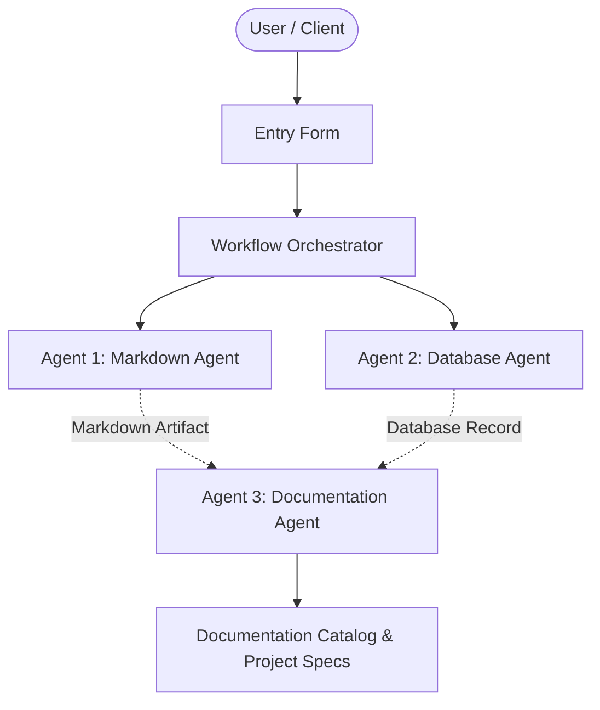

# API Gateway Rate Limiter

## 📋 Project Overview
- **Project Name:** API Gateway Rate Limiter
- **Document Version:** v19
- **Status:** Active
- **Last Modified:** 2026-10-02T16:06:10.896288+00:00

---

## 🎯 Description
Token bucket rate limiting middleware with Redis backplane and IP reputation check.

---

## ⚙️ Requirements & Specifications
The following requirements have been documented for this project:

- [ ] Max 100 req/sec per API key
- [ ] Burst capacity of 150 requests
- [ ] HTTP 429 Too Many Requests response

---

## 📝 Additional Information & Notes
Low latency requirement: < 2ms overhead.

---

## 🏗️ Architectural Blueprint

---

## 📊 Document History
- **Version:** 19
- **Generated by:** Agent 1 (Markdown Agent)
- **Specification:** Model Context Protocol Multi-Agent Workflow
