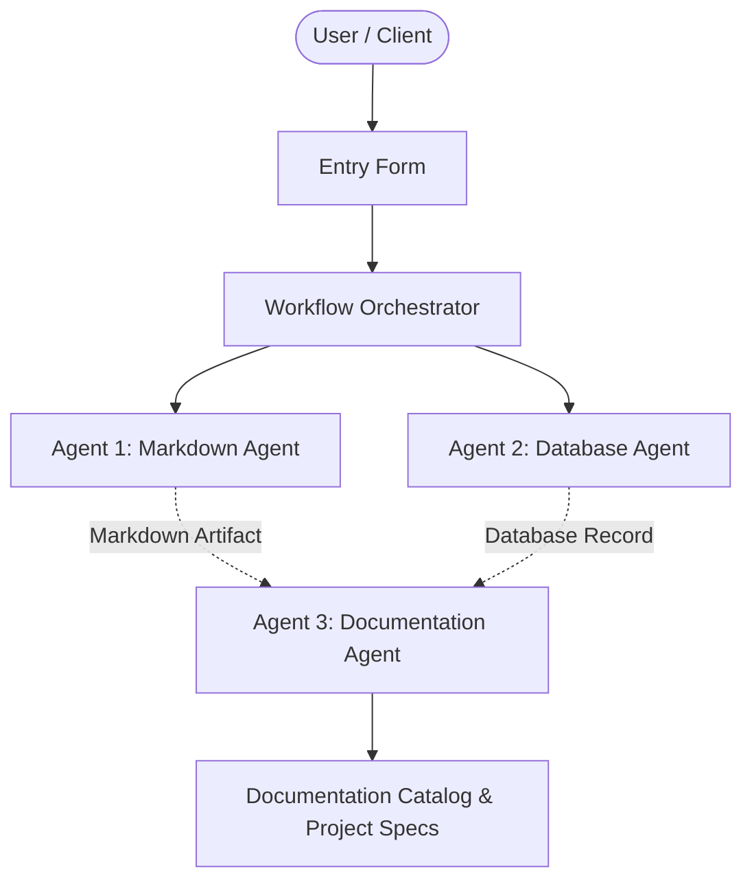

# Autonomous Analytics Pipeline

## 📋 Project Overview
- **Project Name:** Autonomous Analytics Pipeline
- **Document Version:** v1
- **Status:** Active
- **Last Modified:** 2026-10-02T03:52:16.913604+00:00

---

## 🎯 Description
hello

---

## ⚙️ Requirements & Specifications
The following requirements have been documented for this project:

- [ ] damm

---

## 📝 Additional Information & Notes
suck

---

## 🏗️ Architectural Blueprint

---

## 📊 Document History
- **Version:** 1
- **Generated by:** Agent 1 (Markdown Agent)
- **Specification:** Model Context Protocol Multi-Agent Workflow
