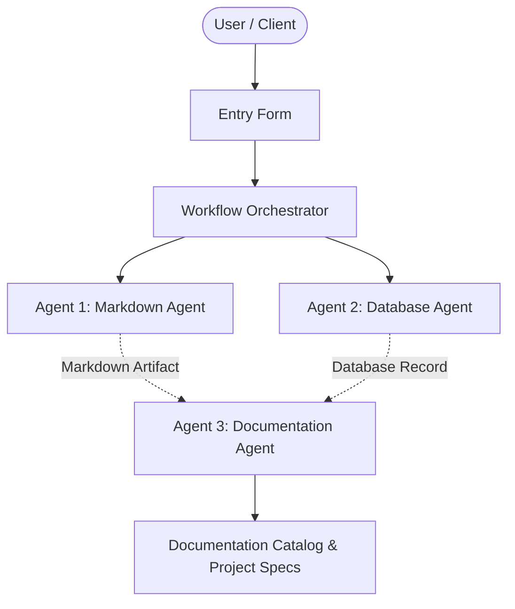

# Autonomous Sentinel

## 📋 Project Overview
- **Project Name:** Autonomous Sentinel
- **Document Version:** v4
- **Status:** Active
- **Last Modified:** 2026-10-02T05:28:20.139613+00:00

---

## 🎯 Description
An autonomous security, surveillance, and threat monitoring sentinel system designed for automated patrolling, real-time threat detection, and incident response.

---

## ⚙️ Requirements & Specifications
The following requirements have been documented for this project:

- [ ] Real-time threat detection and computer vision monitoring
- [ ] Autonomous navigation and route patrolling capabilities
- [ ] Instant alert notification and anomaly escalation system
- [ ] Comprehensive incident logging and forensics tracking
- [ ] Centralized control panel dashboard integration

---

## 📝 Additional Information & Notes
*No additional constraints or notes provided.*

---

## 🏗️ Architectural Blueprint

---

## 📊 Document History
- **Version:** 4
- **Generated by:** Agent 1 (Markdown Agent)
- **Specification:** Model Context Protocol Multi-Agent Workflow
