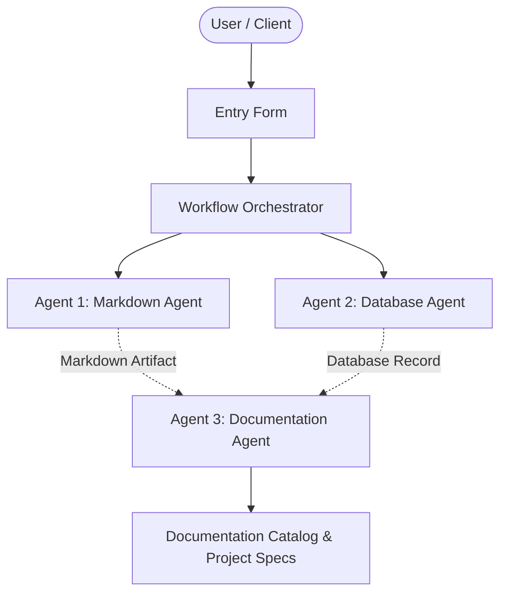

# Cloud Sentinel Security Auditor

## 📋 Project Overview
- **Project Name:** Cloud Sentinel Security Auditor
- **Document Version:** v5
- **Status:** Active
- **Last Modified:** 2026-10-02T15:43:59.775154+00:00

---

## 🎯 Description
Automated cloud infrastructure compliance monitor that continuously scans AWS and GCP environments for security misconfigurations, credential leaks, and excessive IAM privileges.

---

## ⚙️ Requirements & Specifications
The following requirements have been documented for this project:

- [ ] Ingest AWS CloudTrail and VPC Flow Logs in real time
- [ ] Continuous CIS Benchmark compliance scanning
- [ ] Instant webhook alerts for root account access
- [ ] Export daily compliance summaries in Markdown and PDF
- [ ] Sub-second querying for security analyst investigations

---

## 📝 Additional Information & Notes
Security Tier 1 application. Encrypted with AWS KMS at rest, zero outbound access without proxy. Target deployment in Q4 2026.

---

## 🏗️ Architectural Blueprint

---

## 📊 Document History
- **Version:** 5
- **Generated by:** Agent 1 (Markdown Agent)
- **Specification:** Model Context Protocol Multi-Agent Workflow
