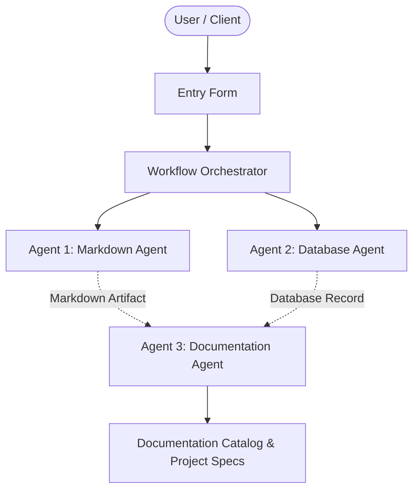

# Enhancement Pipeline Pro 1790264489

## 📋 Project Overview
- **Project Name:** Enhancement Pipeline Pro 1790264489
- **Document Version:** v2
- **Status:** Active
- **Last Modified:** 2026-09-24T15:41:29.988443+00:00

---

## 🎯 Description
Updated description for duplicate test.

---

## ⚙️ Requirements & Specifications
The following requirements have been documented for this project:

- [ ] Updated requirements list.

---

## 📝 Additional Information & Notes
Updated additional notes.

---

## 🏗️ Architectural Blueprint

---

## 📊 Document History
- **Version:** 2
- **Generated by:** Agent 1 (Markdown Agent)
- **Specification:** Model Context Protocol Multi-Agent Workflow
