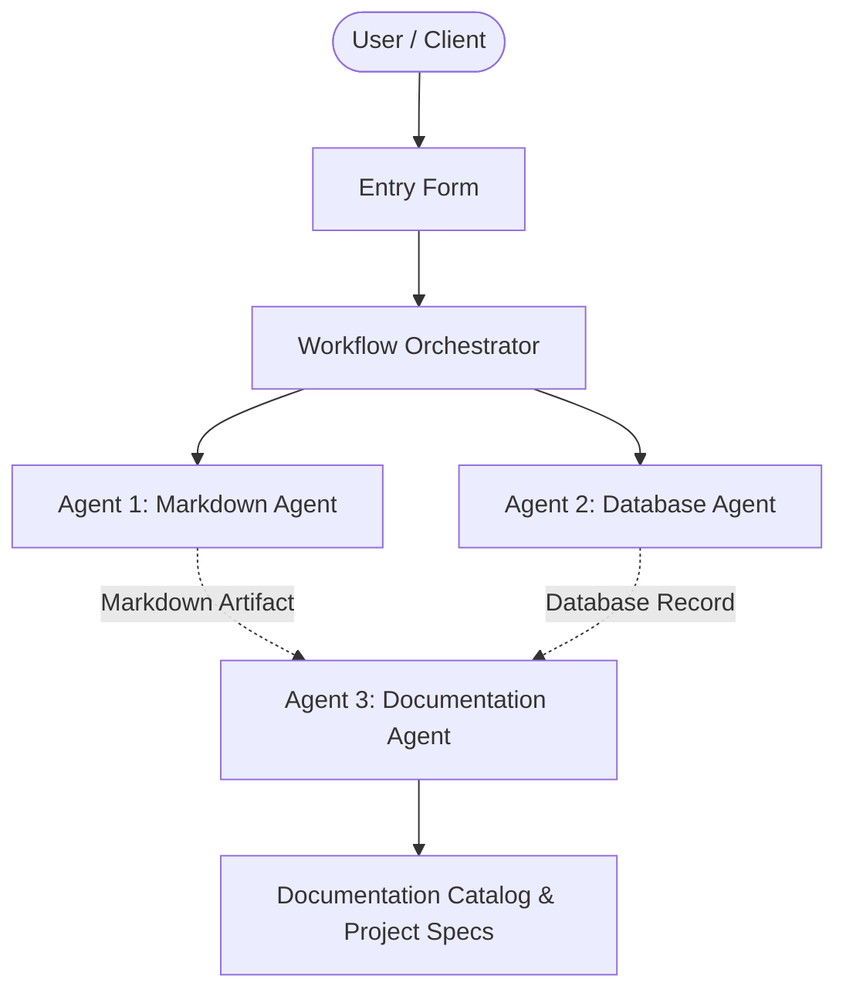

# Enhancement Pipeline Pro 1790913817 (Updated)

## 📋 Project Overview
- **Project Name:** Enhancement Pipeline Pro 1790913817 (Updated)
- **Document Version:** v1
- **Status:** Active
- **Last Modified:** 2026-10-02T04:03:37.638797+00:00

---

## 🎯 Description
Completely refreshed architecture description with TLS 1.3 encryption and zero trust.

---

## ⚙️ Requirements & Specifications
The following requirements have been documented for this project:

- [ ] Zero Trust mTLS
- [ ] Automated canary deployments
- [ ] % availability SLA

---

## 📝 Additional Information & Notes
Updated compliance target: SOC2 Type II.

---

## 🏗️ Architectural Blueprint

---

## 📊 Document History
- **Version:** 1
- **Generated by:** Agent 1 (Markdown Agent)
- **Specification:** Model Context Protocol Multi-Agent Workflow
