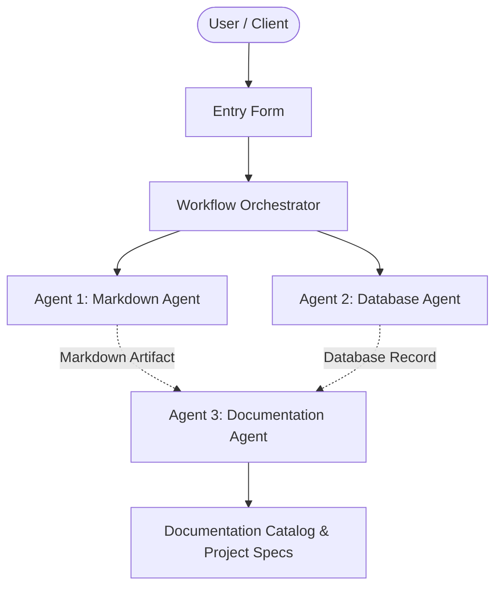

# Live arf

## 📋 Project Overview
- **Project Name:** Live arf
- **Document Version:** v1
- **Status:** Active
- **Last Modified:** 2026-09-28T15:30:18.005638+00:00

---

## 🎯 Description
like attract the customers by our agents and the workers performance

---

## ⚙️ Requirements & Specifications
The following requirements have been documented for this project:

- [ ] subscription plan
- [ ] shopify admin

---

## 📝 Additional Information & Notes
python,SQL,mcp tools

---

## 🏗️ Architectural Blueprint

---

## 📊 Document History
- **Version:** 1
- **Generated by:** Agent 1 (Markdown Agent)
- **Specification:** Model Context Protocol Multi-Agent Workflow
