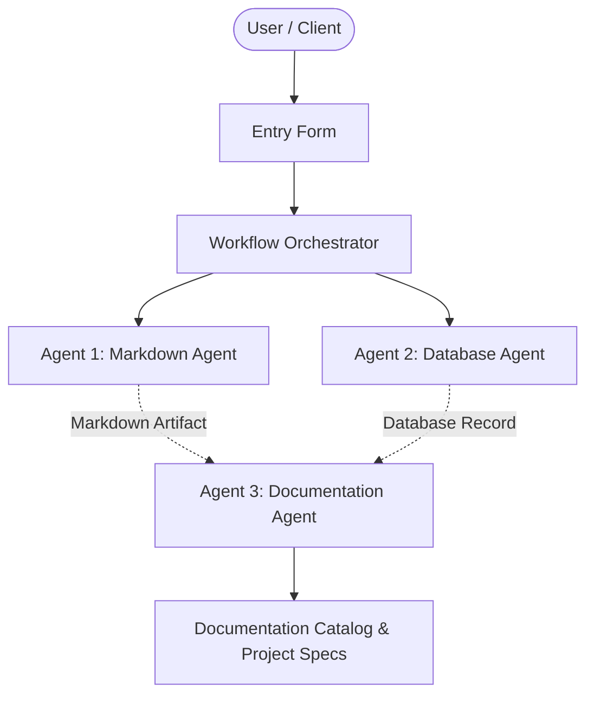

# MedPulse Telemedicine & EHR System

## 📋 Project Overview
- **Project Name:** MedPulse Telemedicine & EHR System
- **Document Version:** v1
- **Status:** Active
- **Last Modified:** 2026-10-02T05:30:34.983308+00:00

---

## 🎯 Description
A secure, HIPAA-compliant healthcare platform providing electronic health records (EHR) management, virtual consultations, appointment scheduling, and patient portal capabilities.

---

## ⚙️ Requirements & Specifications
The following requirements have been documented for this project:

- [ ] Secure HIPAA-compliant user authentication and role-based access control (Patients, Doctors, Admins).
- [ ] Electronic Health Records (EHR) management with data encryption at rest and in transit.
- [ ] Telemedicine / Virtual Consultation module supporting video calls and real-time clinical notes.
- [ ] Appointment scheduling, calendar management, and automated patient notifications.
- [ ] Digital prescription (e-Rx) generation, pharmacy dispatch integration, and lab result portal.

---

## 📝 Additional Information & Notes
Domain: Healthcare / Medical Systems. Target Compliance: HIPAA, GDPR. High availability, zero-trust security architecture.

---

## 🏗️ Architectural Blueprint

---

## 📊 Document History
- **Version:** 1
- **Generated by:** Agent 1 (Markdown Agent)
- **Specification:** Model Context Protocol Multi-Agent Workflow
