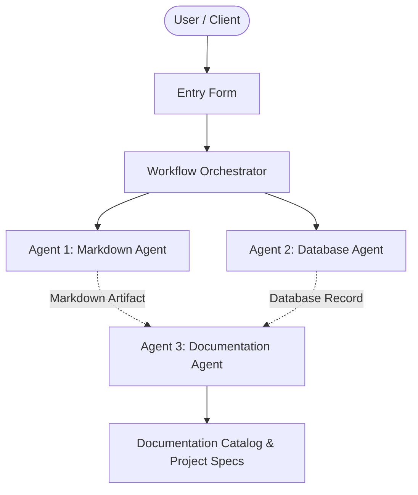

# named Autonomous Sentinel

## 📋 Project Overview
- **Project Name:** named Autonomous Sentinel
- **Document Version:** v1
- **Status:** Active
- **Last Modified:** 2026-10-02T05:39:40.077770+00:00

---

## 🎯 Description
Generated by MCP Host from instruction: Create project named Autonomous Sentinel

---

## ⚙️ Requirements & Specifications
The following requirements have been documented for this project:

- [ ] Autonomous requirement parsing
- [ ] Multi-Agent coordination via MCP
- [ ] Automated documentation

---

## 📝 Additional Information & Notes
Initiated via MCP Host Assistant console.

---

## 🏗️ Architectural Blueprint

---

## 📊 Document History
- **Version:** 1
- **Generated by:** Agent 1 (Markdown Agent)
- **Specification:** Model Context Protocol Multi-Agent Workflow
