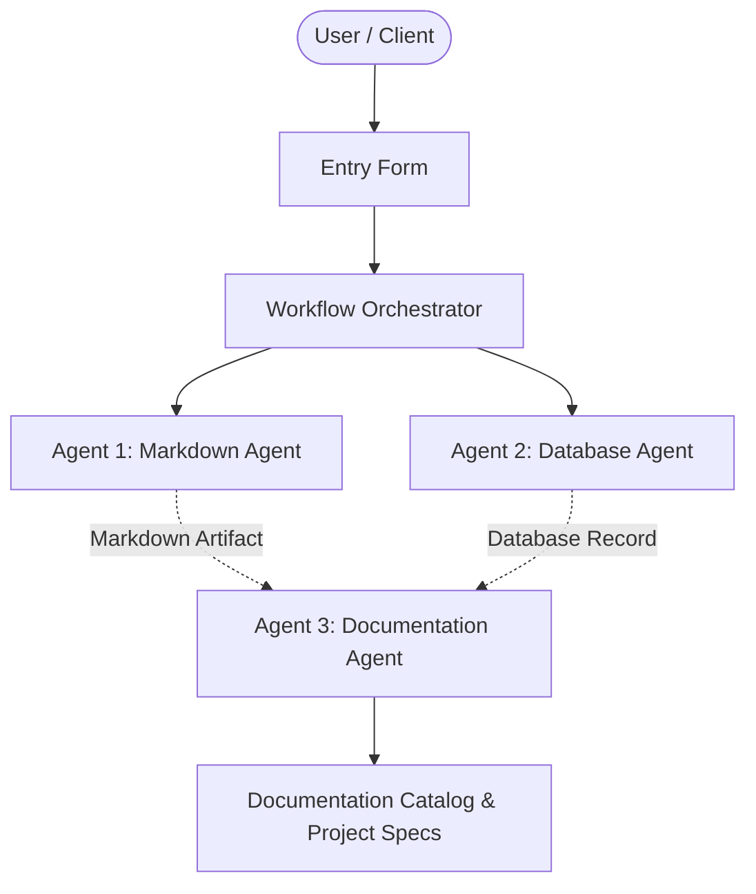

# Online Food Delivery System

## 📋 Project Overview
- **Project Name:** Online Food Delivery System
- **Document Version:** v1
- **Status:** Active
- **Last Modified:** 2026-09-24T14:52:47.907851+00:00

---

## 🎯 Description
A web application for ordering the food and tracking it

---

## ⚙️ Requirements & Specifications
The following requirements have been documented for this project:

- [ ] user login
- [ ] restaurant listing
- [ ] food ordering
- [ ] online payment
- [ ] order tracking

---

## 📝 Additional Information & Notes
The system should be secure ,responsive and easy to use

---

## 🏗️ Architectural Blueprint

---

## 📊 Document History
- **Version:** 1
- **Generated by:** Agent 1 (Markdown Agent)
- **Specification:** Model Context Protocol Multi-Agent Workflow
