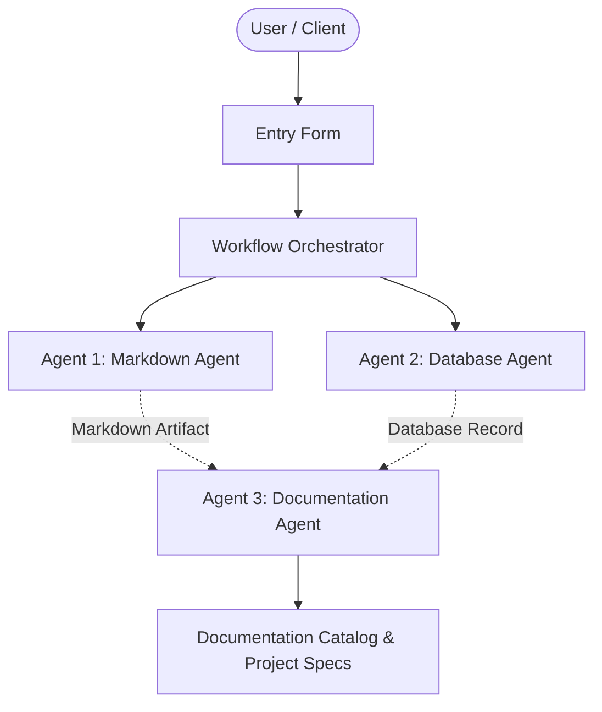

# Quantum Cryptography Suite

## 📋 Project Overview
- **Project Name:** Quantum Cryptography Suite
- **Document Version:** v1
- **Status:** Active
- **Last Modified:** 2026-09-29T11:13:23.085900+00:00

---

## 🎯 Description
Post-quantum cryptographic library implementing lattice-based key exchange algorithms and digital signatures.

---

## ⚙️ Requirements & Specifications
The following requirements have been documented for this project:

- [ ] Implement Kyber-1024 KEM
- [ ] Implement Dilithium digital signatures
- [ ] Zero external runtime dependencies
- [ ] Constant-time C bindings with Python wrappers

---

## 📝 Additional Information & Notes
Targeting NIST FIPS 203 and 204 compliance standards.

---

## 🏗️ Architectural Blueprint

---

## 📊 Document History
- **Version:** 1
- **Generated by:** Agent 1 (Markdown Agent)
- **Specification:** Model Context Protocol Multi-Agent Workflow
