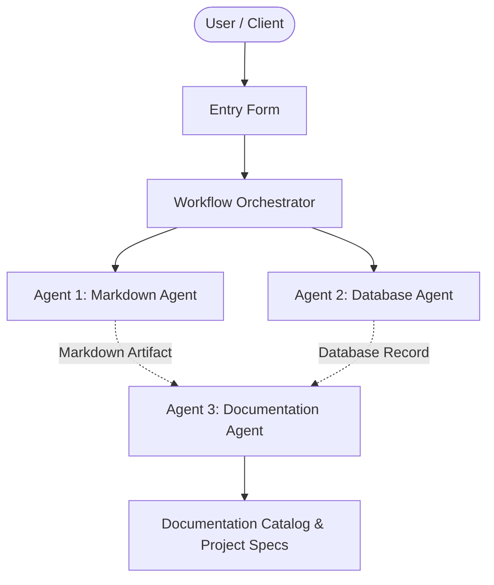

# Workflow Pipeline Check 1790264428

## 📋 Project Overview
- **Project Name:** Workflow Pipeline Check 1790264428
- **Document Version:** v1
- **Status:** Active
- **Last Modified:** 2026-09-24T15:40:29.107128+00:00

---

## 🎯 Description
Verifying end-to-end agent orchestration integrity.

---

## ⚙️ Requirements & Specifications
The following requirements have been documented for this project:

- [ ] Agent 1 generates markdown
- [ ] Agent 2 stores in SQLite
- [ ] Agent 3 compiles documentation

---

## 📝 Additional Information & Notes
Continuous test run

---

## 🏗️ Architectural Blueprint

---

## 📊 Document History
- **Version:** 1
- **Generated by:** Agent 1 (Markdown Agent)
- **Specification:** Model Context Protocol Multi-Agent Workflow
